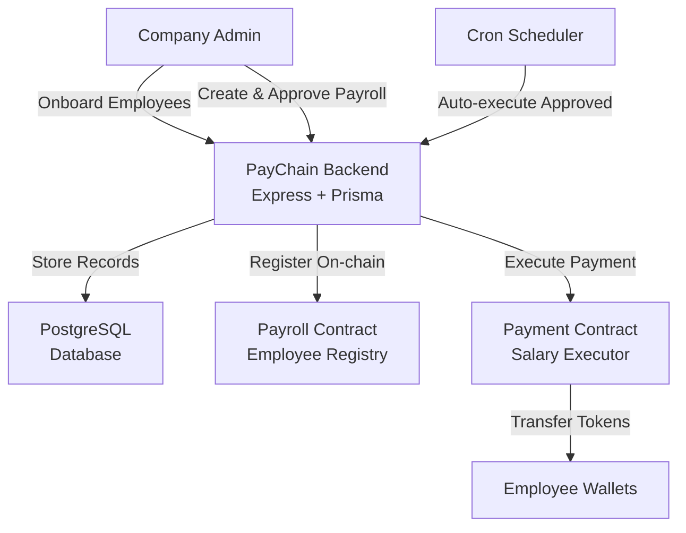
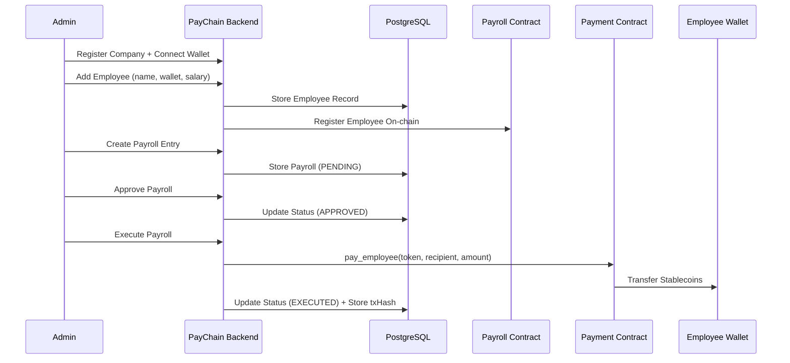

# 💸 PayChain — Decentralized Crypto Payroll Infrastructure

## 1. Problem Statement

Companies hiring global, remote-first teams face serious friction when it comes to **payroll**:

- Traditional payroll providers don't support **cross-border crypto payments**
- Stablecoin transfers are done **manually** through wallets — no audit trail, no automation
- Founders must track salaries, approvals, and payment status in **spreadsheets**
- Employees in emerging markets wait **days** for international wire transfers
- There is no verifiable, on-chain proof of salary commitments or payment execution
- Multi-chain support is fragmented — companies are locked into a single network

Existing crypto payment tools solve **one-off transfers**, but **recurring, compliant, multi-chain payroll** remains an unsolved problem.

---

## 2. Our Core Idea (One Sentence)

> **PayChain is a decentralized payroll platform that lets companies onboard employees, assign salaries, and automate recurring crypto payments using on-chain smart contracts and stablecoin rails.**

---

## 3. High-Level Concept

PayChain sits **between employers and their global workforce**, ensuring that:

1. Companies **register** and configure their payroll settings
2. Admins **onboard employees** with wallet addresses and salary terms
3. Payroll entries are **created, approved, and executed** through a structured workflow
4. All payments are:
   - stablecoin-denominated (USDC, USDT, XLM)
   - executed on-chain via Soroban smart contracts
   - auditable with transaction hashes
   - automatable via cron-based scheduling

---

## 4. Two Core Execution Modes

PayChain supports both **manual payroll execution** and **automated recurring payments**.

| Mode | Description |
|---|---|
| **Manual** | Admin creates → approves → executes individual or bulk payroll entries |
| **Automated** | Cron scheduler detects approved payrolls at payment date and executes on-chain |

This enables **continuous salary payments**, not just one-off transfers.

---

## 5. System Roles

### Company Admin

- Registers the company
- Onboards employees with wallet addresses
- Creates and approves payroll entries
- Executes payments (single or bulk)
- Connects company wallet for on-chain operations

### HR Manager

- Creates payroll entries
- Manages employee records
- Updates employee status (active, suspended, terminated)
- Cancels pending payroll entries

### Employee

- Views personal payroll history
- Tracks payment status and transaction hashes
- Receives stablecoin payments directly to their wallet

---

## 6. What Lives Where (Very Important)

### Off-Chain (Backend + Database)

Stored and processed off-chain:

- user accounts and authentication (JWT)
- company profiles and settings
- employee records and salary configurations
- payroll entries, approval workflows, and status tracking
- analytics and reporting (monthly trends, totals)
- cron-based payment scheduling
- wallet address management

This keeps the system:

- fast and responsive
- privacy-compliant
- flexible for multi-chain expansion

### On-Chain (Soroban Smart Contracts)

Stored on-chain **only**:

- employee registry (wallet, salary, token, active status)
- admin authorization
- payment execution (single + bulk transfers)
- token transfer events
- transaction hashes as proof of payment

No personal data, emails, or company details are stored on-chain.

---

## 7. End-to-End Flow (Payroll Execution)

### Step 1 — Company Setup

- Admin registers on PayChain
- Connects company Stellar wallet
- Smart contracts are initialized with admin address

### Step 2 — Employee Onboarding

- Admin adds employees with name, email, wallet, salary, and token preference
- Employee record is stored in database **and** registered on-chain via Payroll Contract

### Step 3 — Payroll Creation & Approval

- Admin or HR creates payroll entries (amount, token, payment date)
- Admin approves pending payrolls
- Status transitions: `PENDING → APPROVED → EXECUTED`

### Step 4 — Payment Execution

- Admin triggers execution (single or bulk)
- Backend calls Payment Contract's `pay_employee` or `bulk_pay`
- Tokens transfer directly from company wallet to employee wallets
- Transaction hash is recorded; status moves to `EXECUTED`

### Step 5 — Automated Scheduling (Optional)

- Cron job scans for approved payrolls matching today's payment date
- Auto-executes eligible payments on-chain
- Failed payments are retried with incrementing retry count

### Payroll Flow (Diagram)



### Detailed Sequence Flow



---

## 8. Authentication & Authorization Model

Authentication is handled entirely off-chain via JWT.

- Passwords are hashed with bcrypt
- Role-based access control enforces permission boundaries
- Only `ADMIN` can execute payments and manage company settings
- `HR_MANAGER` can manage employees and create payrolls
- `EMPLOYEE` has read-only access to their own records

This ensures:

- security without on-chain identity complexity
- flexible role management
- clean separation between auth and payment layers

---

## 9. Why This Model Works

### For Companies

- Full payroll lifecycle in one platform
- Stablecoin payments — no bank delays
- On-chain proof of every payment
- Bulk execution saves time and gas

### For HR Teams

- Structured approval workflows
- Employee status management (active, suspended, terminated)
- Analytics dashboard with monthly trends

### For Employees

- Direct wallet payments — no intermediaries
- Transparent payment history with transaction hashes
- Multi-token support (USDC, USDT, XLM)

---

## 10. Key Differentiation

| Feature | Traditional Payroll | Manual Crypto Transfers | PayChain |
|---|:---:|:---:|:---:|
| Cross-border payments | ❌ | ✅ | ✅ |
| Stablecoin support | ❌ | ✅ | ✅ |
| Approval workflows | ✅ | ❌ | ✅ |
| On-chain execution | ❌ | ✅ | ✅ |
| Bulk payments | ✅ | ❌ | ✅ |
| Automated scheduling | ✅ | ❌ | ✅ |
| Employee management | ✅ | ❌ | ✅ |
| Transaction audit trail | ❌ | Partial | ✅ |
| Multi-chain ready | ❌ | ❌ | ✅ |

---

## 11. Design Principles

- **Workflow-first**: every payment follows create → approve → execute
- **Automation over manual ops**: cron scheduling eliminates repetitive tasks
- **Minimal on-chain data**: contracts handle payments and registry — nothing else
- **Off-chain intelligence**: employee management, analytics, and auth stay in the backend
- **Multi-chain by design**: schema supports Stellar, Celo, Base, and Ethereum
- **Non-custodial**: company funds transfer directly to employee wallets

---

## 12. What PayChain Is (and Is Not)

### PayChain Is

- a decentralized payroll management platform
- a stablecoin payment automation layer
- an employee registry with on-chain verification
- a structured approval workflow for salary disbursements

### PayChain Is Not

- a DEX or trading platform
- a custodial wallet service
- a tax or compliance provider
- a replacement for accounting software

---

## 13. Tech Stack

| Layer | Technology |
|---|---|
| Frontend | Next.js 15, TypeScript, Tailwind CSS, Shadcn UI |
| Backend | Node.js, Express, Prisma ORM, PostgreSQL |
| Blockchain | Stellar SDK, Soroban Smart Contracts (Rust) |
| Auth | JWT, bcrypt |
| Scheduling | node-cron |
| Charts | Recharts |
| State | Zustand, React Query |

---

## 14. Project Structure

```
paychain/
├── apps/
│   ├── frontend/                  # Next.js 15 app
│   │   ├── app/
│   │   │   ├── (auth)/            # Login, Register
│   │   │   ├── (dashboard)/       # Protected dashboard routes
│   │   │   └── page.tsx           # Landing page
│   │   ├── components/
│   │   │   ├── ui/                # Shadcn-style UI primitives
│   │   │   ├── layout/            # Sidebar, Topbar
│   │   │   ├── dashboard/         # Stat cards, charts
│   │   │   ├── employees/         # Employee dialogs
│   │   │   ├── payroll/           # Payroll dialogs
│   │   │   └── wallet/            # Wallet button
│   │   ├── store/                 # Zustand stores (auth, wallet)
│   │   ├── hooks/                 # Custom hooks
│   │   ├── lib/                   # API client, utils
│   │   └── types/                 # TypeScript types
│   └── backend/                   # Express API
│       ├── src/
│       │   ├── routes/            # auth, employees, payroll, analytics, wallets
│       │   ├── controllers/       # Request handlers
│       │   ├── middleware/        # auth, error
│       │   ├── services/          # stellar, payment
│       │   ├── jobs/              # payroll-scheduler (cron)
│       │   ├── utils/             # prisma, auth, config, validators
│       │   └── types/             # shared types
│       └── prisma/
│           └── schema.prisma      # Database schema
└── contracts/                     # Soroban smart contracts (Rust)
    ├── payroll/                   # Employee registry contract
    └── payment/                   # Payment executor contract
```

---

## 15. Smart Contracts

PayChain uses two Soroban smart contracts on the Stellar network:

### Payroll Contract — Employee Registry

Manages the on-chain employee registry with admin-gated access.

| Function | Description | Auth |
|---|---|---|
| `initialize` | Set admin address and create empty employee list | One-time |
| `add_employee` | Register employee with wallet, salary, and token | Admin |
| `remove_employee` | Remove employee from registry | Admin |
| `get_employee` | Query a single employee record | Public |
| `get_employees` | List all registered employee addresses | Public |

### Payment Contract — Salary Executor

Handles actual token transfers from company to employee wallets.

| Function | Description | Auth |
|---|---|---|
| `initialize` | Set admin and link to payroll contract | One-time |
| `pay_employee` | Execute a single salary payment via token transfer | Admin |
| `bulk_pay` | Execute batch payments to multiple employees | Admin |

### Building & Deploying

```bash
# Build contracts
cd contracts
stellar contract build

# Deploy to testnet
stellar contract deploy --wasm target/wasm32-unknown-unknown/release/paychain_payroll.wasm \
  --source <SECRET> --network testnet
```

---

## 16. Quick Start

### Prerequisites

- Node.js 20+
- PostgreSQL 14+
- Redis (optional)
- Rust + Stellar CLI (for contracts)

### 1. Clone & Install

```bash
git clone <repo>
cd paychain
npm install
```

### 2. Configure Environment

```bash
# Backend
cp apps/backend/.env.example apps/backend/.env
# Required: DATABASE_URL, JWT_SECRET, STELLAR_ADMIN_SECRET

# Frontend
cp apps/frontend/.env.example apps/frontend/.env.local
# Required: NEXT_PUBLIC_API_URL
```

### 3. Setup Database

```bash
cd apps/backend
npm run db:push       # Push schema to DB
npm run db:generate   # Generate Prisma client
```

### 4. Run Development

```bash
# From root — starts both frontend and backend
npm run dev

# Frontend: http://localhost:3000
# Backend:  http://localhost:4000
# Health:   http://localhost:4000/health
```

### 5. Docker (Optional)

```bash
docker-compose up -d   # Starts postgres + redis + backend
```

---

## 17. Deployment

### Frontend → Vercel

```bash
cd apps/frontend
vercel deploy
```

### Backend → Railway

1. Connect repo to Railway
2. Set root directory to `apps/backend`
3. Add environment variables
4. Deploy

### Database → Supabase

1. Create project at supabase.com
2. Copy connection string to `DATABASE_URL`
3. Run `npm run db:push`

---

## 18. Supported Tokens

| Token | Network | Status |
|---|---|---|
| USDC | Stellar | ✅ Live |
| USDT | Stellar | ✅ Live |
| XLM | Stellar | ✅ Live |

---

## 19. Roadmap

- [ ] Celo chain support
- [ ] Base chain support
- [ ] Fiat-to-crypto onramp
- [ ] Tax estimation module
- [ ] AI payroll insights
- [ ] Employee NFT identity
- [ ] DAO treasury integration
- [ ] Real-time salary streaming (Soroban)

---

## 20. Vision

PayChain's long-term vision is to become the default payroll infrastructure for crypto-native companies, enabling a shift from:

> "We sent tokens to wallets."

to:

> "We run a fully automated, auditable, multi-chain payroll system."

---

## 21. One-Line Summary

> **PayChain turns company payroll into automated, on-chain stablecoin payments for global teams.**

---

## License

MIT
